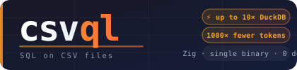

<p align="center">
  
</p>

[](https://github.com/melihbirim/csvql/actions/workflows/ci.yml)
[](LICENSE.md)
[](https://github.com/melihbirim/csvql/releases)

**The analytical CSV query engine for AI agents.**

Run SQL analytics — `GROUP BY`, aggregates, joins, time-series — on CSV files **in place**: no database, no import, no ingest. csvql ships as an [MCP](https://modelcontextprotocol.io/) server, so an LLM can query a gigabyte file for a few hundred tokens instead of pasting it (impossible) into context. A single static binary written in Zig. Your data never leaves your machine.

> A database is something you load your data *into*. csvql is a query you run on the data where it already lives.

**Read-only and on-prem by design.** csvql only runs `SELECT` — it has no `INSERT`/`UPDATE`/`DELETE`/`DROP` and physically cannot modify your data. It makes zero network calls, needs no cloud, and runs fully air-gapped. **Our next north star:** the safe way to give AI agents query access to corporate data — run csvql *next to the data* on your own servers (read-only, nothing leaves the box) instead of shipping files out to an LLM.

### Token economics: query files instead of pasting them

Pasting a 417 MB CSV into an LLM costs **230 million tokens** — it fits no context window. Over MCP, the agent queries the file in place and gets back only the answer:

| Question an agent asks | Tokens used |
| ---------------------- | ----------- |
| *"How many trips per cab type?"* | **43** |
| *"Which year was busiest?"* | **49** |
| *"Average fare by passenger count?"* | **123** |

Same answers, **~1,000–500,000× fewer tokens** — flat, regardless of file size. One command wires it into Claude: [`csvql install`](#setup). Measure it yourself: [`bench/bench_tokens.py`](bench/bench_tokens.py).

```bash
$ csvql "SELECT cab_type, COUNT(*) FROM 'trips.csv' GROUP BY cab_type"
cab_type,COUNT(*)
green,32447
yellow,967553
  0.05s — no import, queried straight off the file
```

[Quick Start](#quick-start) · [Installation](#installation) · [Performance](#performance) · [SQL Reference](#sql-reference) · [Docs](#documentation)

---

## Quick Start

csvql auto-detects SQL or simple mode from your input:

```bash
# SQL mode
csvql "SELECT name, salary FROM 'data.csv' WHERE age > 30 ORDER BY salary DESC LIMIT 10"

# Simple mode — same query, shorter syntax
csvql data.csv "name,salary" "age>30" 10 "salary:desc"

# Just browse a file
csvql data.csv
```

### Unix Pipes

```bash
cat data.csv | csvql "SELECT name, age FROM '-' WHERE age > 25"
csvql "SELECT * FROM 'data.csv' WHERE status = 'active'" > output.csv
csvql "SELECT email FROM 'users.csv'" | wc -l
```

### Flags

| Flag                 | Short | Description                                         |
| -------------------- | ----- | --------------------------------------------------- |
| `--no-header`        |       | Suppress header row in output                       |
| `--delimiter <char>` | `-d`  | Field delimiter (default `,`). Use `\t` for TSV     |
| `--json`             |       | Output as a JSON array (`[{...}, ...]`)             |
| `--jsonl`            |       | Output as JSONL / NDJSON (one JSON object per line) |
| `--version`          | `-v`  | Show version                                        |
| `--help`             | `-h`  | Show help                                           |
| `--mcp`              |       | Start as an MCP server (stdio JSON-RPC transport)   |

```bash
# TSV file
csvql "SELECT name, salary FROM 'data.tsv'" -d $'\t'

# Pipe into another tool that expects no header
csvql "SELECT name, age FROM 'data.csv'" --no-header | awk -F, '{print $2}'

# TSV input, no header in output
cat data.tsv | csvql "SELECT * FROM '-'" -d $'\t' --no-header
```

## Installation

### Homebrew (macOS / Linux)

```bash
brew install melihbirim/csvql/csvql
```

Or in two steps if you plan to install multiple tools from this tap:

```bash
brew tap melihbirim/csvql
brew install csvql
```

> `melihbirim/csvql` is the tap (the formula repository), and the trailing `/csvql` is the formula name inside it.

### Prebuilt Binaries

Download from [GitHub Releases](https://github.com/melihbirim/csvql/releases):

```bash
# macOS (Apple Silicon)
curl -L https://github.com/melihbirim/csvql/releases/latest/download/csvql-macos-aarch64.tar.gz | tar xz
sudo mv csvql-macos-aarch64 /usr/local/bin/csvql

# macOS (Intel)
curl -L https://github.com/melihbirim/csvql/releases/latest/download/csvql-macos-x86_64.tar.gz | tar xz
sudo mv csvql-macos-x86_64 /usr/local/bin/csvql

# Linux (x86_64)
curl -L https://github.com/melihbirim/csvql/releases/latest/download/csvql-linux-x86_64.tar.gz | tar xz
sudo mv csvql-linux-x86_64 /usr/local/bin/csvql
```

### Build from Source

Requires [Zig](https://ziglang.org/) 0.13.0+ (tested with 0.15.2):

```bash
git clone https://github.com/melihbirim/csvql.git
cd csvql
zig build -Doptimize=ReleaseFast
sudo cp zig-out/bin/csvql /usr/local/bin/
```

## Performance

**1M rows, 35MB CSV, Apple M2** — all tools forced to output all rows (no display tricks):

| Query                             | csvql      | DuckDB | Speedup  |
| --------------------------------- | ---------- | ------ | -------- |
| WHERE + ORDER BY LIMIT 10         | **0.020s** | 0.179s | **9x**   |
| ORDER BY LIMIT 10                 | **0.041s** | 0.165s | **4x**   |
| ORDER BY (all 1M rows)            | **0.156s** | 1.221s | **7.8x** |
| WHERE (full output)               | **0.141s** | 0.739s | **5.2x** |
| Full scan (all 1M rows)           | **0.196s** | 1.163s | **5.9x** |
| `COUNT(*) GROUP BY` (6 groups)    | **0.060s** | 0.110s | **1.8x** |
| `SUM + AVG GROUP BY` (6 groups)   | **0.070s** | 0.110s | **1.6x** |
| `SUM(CASE WHEN) GROUP BY`         | **0.016s** | 0.114s | **7.1x** |
| `SELECT DISTINCT city` (8 values) | **0.060s** | 0.110s | **1.8x** |
| `SELECT COUNT(*)` scalar          | **0.050s** | 0.100s | **2x**   |
| `SELECT SUM(salary)` scalar       | **0.050s** | 0.110s | **2.2x** |

**35x less memory** than DuckDB (1.8MB vs 63.5MB).

**5M rows, 173MB CSV, Apple M2** — output-format benchmark (full output, all rows matched, `> /dev/null`):

| Output format              | csvql      | DuckDB | Speedup  |
| -------------------------- | ---------- | ------ | -------- |
| CSV                        | **0.100s** | 0.354s | **3.5x** |
| JSON array (`--json`)      | **0.164s** | 0.434s | **2.6x** |
| JSONL / NDJSON (`--jsonl`) | **0.172s** | 0.422s | **2.5x** |

Outputs are semantically/byte-identical to DuckDB (verified: CSV byte-for-byte diff; JSONL byte-for-byte diff; JSON array Python-parsed row comparison).

Run the benchmark yourself: [`bench/bench_all.sh --section formats`](bench/bench_all.sh)

**5M rows, 173MB CSV, Apple M2** — LIKE operator benchmark (CSV output, `> /dev/null`):

| Pattern                        | Description              | csvql     | DuckDB | Speedup  |
| ------------------------------ | ------------------------ | --------- | ------ | -------- |
| `WHERE name LIKE 'A%'`         | Prefix wildcard          | **0.06s** | 2.17s  | **~36x** |
| `WHERE city LIKE '%on'`        | Suffix wildcard          | **0.06s** | 1.12s  | **~19x** |
| `WHERE department LIKE '%ing'` | Suffix, high selectivity | **0.07s** | 2.54s  | **~36x** |

Row counts verified identical to DuckDB.

Run the benchmark yourself: [`bench/bench_all.sh --section like`](bench/bench_all.sh)

**1M rows, 35MB CSV, Apple M2** — JOIN benchmark (hash-join, CSV output, `> /dev/null`):

| Query                                          | csvql      | DuckDB | Speedup   |
| ---------------------------------------------- | ---------- | ------ | --------- |
| `JOIN departments` (1M × 6 rows)               | **0.140s** | 1.492s | **10.7x** |
| `JOIN + WHERE d.region = 'West'` (1M × 6)      | **0.102s** | 0.600s | **5.9x**  |
| `JOIN SELECT *` (1M × 6, all cols)             | **0.220s** | 4.130s | **18.8x** |
| `JOIN cities` (1M × 8 rows)                    | **0.146s** | 1.464s | **10.0x** |
| `JOIN bonus_50k` (1M × 50K rows, numeric key)  | **0.104s** | 0.276s | **2.7x**  |

Run the benchmark yourself: [`bench/bench_all.sh --section join`](bench/bench_all.sh)

**NYC Taxi benchmark — 20M rows, 8 GB CSV, Apple M-series** — the canonical [Billion-Taxi-Rides](https://github.com/pdet/taxi-benchmark) queries on [DuckDB's own dataset](https://duckdb.org/2024/10/16/driving-csv-performance-benchmarking-duckdb-with-the-nyc-taxi-dataset). Both engines query the raw uncompressed CSV **directly** (no preload into a native store), cold per run, best-of-5, warm OS cache:

| Query                                                       | csvql     | DuckDB | Speedup  |
| ----------------------------------------------------------- | --------- | ------ | -------- |
| Q01 `COUNT(*) GROUP BY cab_type`                            | **1.29s** | 3.55s  | **2.8x** |
| Q02 `AVG(total_amount) GROUP BY passenger_count`            | **1.41s** | 3.81s  | **2.7x** |
| Q03 `COUNT(*) GROUP BY passenger_count, year`               | **1.36s** | 4.01s  | **2.9x** |
| Q04 `GROUP BY passenger_count, year, ROUND(distance) ...`   | **1.38s** | 3.99s  | **2.9x** |

Results verified identical to DuckDB. The gap **widens on smaller files** — ~10x on the 417 MB / 1M-row sample, where DuckDB's process and CSV-reader startup dominate; on 8 GB the actual parse+aggregate work dominates and csvql holds a clean ~2.8x.

Reproduce: [`bench/bench_taxi.sh`](bench/bench_taxi.sh) — `./bench/bench_taxi.sh --sample` (417 MB, quick) or `./bench/bench_taxi.sh 1` (full 20M rows, ~8 GB download).

**Memory & storage — same 8 GB / 20M-row file** (peak memory footprint, single cold run):

| Query | csvql peak | DuckDB peak |
| ----- | ---------- | ----------- |
| Q01   | **29 MB**  | 178 MB      |
| Q02   | **30 MB**  | 210 MB      |
| Q03   | **34 MB**  | 208 MB      |
| Q04   | **38 MB**  | 219 MB      |

**~6x less memory** — and csvql needs **0 bytes of extra storage**: it queries the CSV in place via mmap, no ingest. DuckDB's fast "with storage" path first materializes a **2.1 GB native store (21.7 s one-time ingest)** before it can reach comparable query times; querying the raw CSV directly (as csvql does), it uses ~6x the memory and stays ~2.8x slower.

Reproduce: `./bench/bench_taxi.sh --resources 1` (or `--resources --sample`).

**At scale, csvql reads raw CSV about as fast as your OS can hand it the bytes.** On the 8 GB file, `SELECT COUNT(*)`, `GROUP BY cab_type`, and `GROUP BY + AVG` all run in **~1.31 s** — the same time as `cat file > /dev/null` (~1.30 s) on the same machine. The parsing, grouping, and aggregation are effectively free; the whole query is bounded by the file read itself. There is no meaningful parsing overhead left to remove — csvql is already at the read ceiling, which is why the raw-CSV gap over DuckDB (which does more work per byte) holds at ~2.8x.

Run the full suite (all sections): [`bench/bench_all.sh`](bench/bench_all.sh)

<details>
<summary><b>How is csvql so fast?</b></summary>

- **Memory-mapped I/O** — zero-copy reading at 1.4 GB/sec
- **7-core parallel execution** — lock-free architecture, 669% CPU utilization
- **SIMD field parsing** — vectorized comma detection
- **Radix sort** — O(8N) with IEEE 754 f64→u64 bit trick and pass-skipping
- **Top-K heap** — O(N log K) for LIMIT queries, avoids sorting entire dataset
- **Hardware-aware thresholds** — ARM vs x86 tuned for L1 cache
- **Zero per-row allocations** — arena buffers, zero-copy slices
- **Adaptive GROUP BY pre-sizing** — hash table capacity tuned to chunk size, eliminates rehash cycles
- **Zero-copy worker scans** — each thread iterates a direct mmap slice, no `pread` syscalls or seam buffers

See [ARCHITECTURE.md](ARCHITECTURE.md) for the full optimization story.

</details>

<details>
<summary><b>Benchmark methodology</b></summary>

DuckDB and DataFusion CLIs default to displaying only 40 rows, making them appear faster than they are. Our benchmarks use `-csv` mode (DuckDB) and `FORMAT CSV` (ClickHouse) to force full output materialization. DataFusion CLI caps output at ~8K rows regardless of settings, so full-output numbers are unavailable.

See [BENCHMARKS.md](BENCHMARKS.md) for the complete analysis.

</details>

## SQL Reference

### Supported

| Feature       | Syntax                                                                  |
| ------------- | ----------------------------------------------------------------------- |
| **SELECT**    | `SELECT col1, col2` or `SELECT *`                                       |
| **AS alias**  | `SELECT expr AS alias` — rename any column or expression in output      |
| **DISTINCT**  | `SELECT DISTINCT col1, col2` — deduplicates output rows                 |
| **FROM**      | `FROM 'file.csv'` or `FROM -` (stdin)                                   |
| **WHERE**     | `=`, `!=`, `>`, `>=`, `<`, `<=` with auto numeric coercion              |
| **LIKE**      | `WHERE col LIKE 'pattern'` — `%` any sequence, `_` any single char      |
| **ILIKE**     | `WHERE col ILIKE 'pattern'` — same as LIKE but case-insensitive         |
| **BETWEEN**   | `WHERE col BETWEEN low AND high` — inclusive numeric or string range    |
| **IN**        | `WHERE col IN ('a', 'b', 'c')` — membership test                        |
| **IS NULL**   | `WHERE col IS NULL` / `WHERE col IS NOT NULL` — empty-field test        |
| **NOT**       | `WHERE NOT expr` — logical negation of any condition                    |
| **AND / OR**  | `WHERE cond1 AND cond2` / `WHERE cond1 OR cond2` — compound conditions  |
| **JOIN**      | `FROM 'a.csv' a [INNER] JOIN 'b.csv' b ON a.key = b.key`               |
| **GROUP BY**  | `GROUP BY col1` or `GROUP BY alias` — groups rows; accepts SELECT aliases |
| **COUNT**     | `COUNT(*)` or `COUNT(col)` — with or without `GROUP BY`                 |
| **SUM**       | `SUM(col)` or `SUM(CASE WHEN cond THEN n ELSE m END)` — conditional sum |
| **AVG**       | `AVG(col)` — full precision; with or without `GROUP BY`                 |
| **CASE WHEN** | `CASE WHEN col OP val THEN n ELSE m END` inside any aggregate function  |
| **MIN / MAX** | `MIN(col)`, `MAX(col)` — with or without `GROUP BY`                     |
| **HAVING**    | `HAVING expr` — filter groups after aggregation (e.g. `HAVING COUNT(*) > 5`) |
| **STRFTIME**  | `STRFTIME('%Y-%m', col)` — date bucketing in `SELECT` and `GROUP BY`    |
| **DATE_PART** | `DATE_PART('year', col)` — extract `year`/`month`/`day`/`hour`/`minute`/`second`; alias for `STRFTIME` in `SELECT` and `GROUP BY` |
| **UPPER / LOWER** | `SELECT UPPER(col), LOWER(col)` — case conversion                  |
| **TRIM**      | `SELECT TRIM(col)` — strip leading and trailing whitespace              |
| **LENGTH**    | `SELECT LENGTH(col)` — byte length of the value                         |
| **SUBSTR**    | `SELECT SUBSTR(col, start, len)` — substring (1-based, `len` optional)  |
| **ABS / CEIL / FLOOR** | `SELECT ABS(col), CEIL(col), FLOOR(col)` — numeric functions  |
| **MOD**       | `SELECT MOD(col, n)` — modulo by a numeric literal                      |
| **ROUND**     | `SELECT ROUND(col)` — round to integer; `ROUND(col, n)` — round to `n` decimal places |
| **COALESCE**  | `SELECT COALESCE(col, 'default')` — replace empty/null with fallback    |
| **CAST**      | `SELECT CAST(col AS INTEGER/FLOAT/TEXT)` — type conversion              |
| **DATEDIFF**  | `DATEDIFF('unit', start_col, end_col)` — duration between two datetime columns. Units: `second`, `minute`, `hour`, `day`, `week`, `month` (≈30 days), `year` (≈365 days). Auto-detects ISO-8601, US (MM/DD/YYYY), EU (DD.MM.YYYY) and mixed formats in the same file |
| **DATEADD**   | `DATEADD('unit', amount, date_col)` — add/subtract interval from a datetime column. `amount` may be negative. Units: `second`, `minute`, `hour`, `day`, `week`, `month` (≈30 days), `year` (≈365 days). Returns `YYYY-MM-DD HH:MM:SS` |
| **ORDER BY**  | `ORDER BY col [ASC\|DESC]`, multi-column `ORDER BY col1 ASC, col2 DESC`, alias, or positional (`ORDER BY 1`) |
| **LIMIT**     | `LIMIT n`                                                               |

### Aggregate Examples

```bash
# Scalar aggregates (whole table)
csvql "SELECT COUNT(*), SUM(salary), AVG(salary), MIN(age), MAX(age) FROM 'data.csv'"

# Grouped aggregates
csvql "SELECT department, COUNT(*), AVG(salary) FROM 'data.csv' GROUP BY department ORDER BY department"

# HAVING — filter groups after aggregation
csvql "SELECT department, SUM(salary) FROM 'data.csv' GROUP BY department HAVING SUM(salary) > 500000"
csvql "SELECT category, COUNT(*) FROM 'orders.csv' GROUP BY category HAVING COUNT(*) > 1000"

# CASE WHEN inside aggregates — conditional counting and summing
csvql "SELECT department, COUNT(*) AS total, SUM(CASE WHEN city = 'London' THEN 1 ELSE 0 END) AS london_count FROM 'data.csv' GROUP BY department"
csvql "SELECT SUM(CASE WHEN status = 'active' THEN 1 ELSE 0 END) AS active, SUM(CASE WHEN status = 'inactive' THEN 1 ELSE 0 END) AS inactive FROM 'data.csv'"
csvql "SELECT product, COUNT(*) AS total, SUM(CASE WHEN status = 'returned' THEN 1 ELSE 0 END) AS returns FROM 'orders.csv' GROUP BY product ORDER BY returns DESC"

# DISTINCT
csvql "SELECT DISTINCT city FROM 'data.csv' ORDER BY city"
csvql "SELECT DISTINCT city, department FROM 'data.csv'"

# DISTINCT with WHERE
csvql "SELECT DISTINCT department FROM 'data.csv' WHERE salary > 100000"
```

### Scalar Function Examples

Scalar functions transform column values row-by-row in `SELECT`. They can also be used in `GROUP BY` projections.

```bash
# String functions
csvql "SELECT UPPER(name), LOWER(city), TRIM(notes) FROM 'data.csv'"
csvql "SELECT name, LENGTH(name), SUBSTR(name, 1, 3) FROM 'data.csv'"

# Numeric functions
csvql "SELECT name, ABS(balance), CEIL(score), FLOOR(score) FROM 'data.csv'"
csvql "SELECT name, MOD(age, 10) AS age_decade FROM 'data.csv'"
csvql "SELECT name, ROUND(price) AS rounded, ROUND(price, 2) AS price_2dp FROM 'data.csv'"

# COALESCE — replace empty values with a fallback
csvql "SELECT name, COALESCE(email, 'unknown') FROM 'data.csv'"
csvql "SELECT COALESCE(phone, COALESCE(email, 'no contact')) FROM 'contacts.csv'"

# CAST — explicit type conversion
csvql "SELECT name, CAST(price AS INTEGER), CAST(id AS TEXT) FROM 'products.csv'"
csvql "SELECT CAST(year AS INTEGER) AS yr, SUM(revenue) FROM 'data.csv' GROUP BY yr"

# ILIKE — case-insensitive LIKE
csvql "SELECT * FROM 'data.csv' WHERE name ILIKE '%smith%'"
csvql "SELECT * FROM 'data.csv' WHERE email ILIKE '%@gmail.com'"

# Scalar functions work with GROUP BY
csvql "SELECT UPPER(city), COUNT(*) FROM 'data.csv' GROUP BY city"
csvql "SELECT LOWER(department) AS dept, AVG(salary) FROM 'data.csv' GROUP BY department"

# Mix scalars with AS aliases
csvql "SELECT UPPER(name) AS Name, CAST(salary AS INTEGER) AS Salary FROM 'data.csv' ORDER BY Salary DESC"
```

### WHERE Filter Examples

```bash
# Comparison operators
csvql "SELECT name, salary FROM 'data.csv' WHERE salary > 80000"

# BETWEEN — inclusive range (numeric or string)
csvql "SELECT name, salary FROM 'data.csv' WHERE salary BETWEEN 50000 AND 80000"
csvql "SELECT * FROM 'orders.csv' WHERE order_date BETWEEN '2025-01-01' AND '2025-12-31'"

# IN — membership test
csvql "SELECT name FROM 'data.csv' WHERE city IN ('London', 'Paris', 'Berlin')"

# IS NULL / IS NOT NULL — test for missing (empty) fields
csvql "SELECT * FROM 'data.csv' WHERE email IS NULL"
csvql "SELECT * FROM 'data.csv' WHERE email IS NOT NULL"

# NOT — negate any condition
csvql "SELECT * FROM 'data.csv' WHERE NOT city IN ('London', 'Paris')"
csvql "SELECT * FROM 'data.csv' WHERE NOT salary BETWEEN 40000 AND 60000"

# AND / OR — compound conditions
csvql "SELECT * FROM 'data.csv' WHERE age > 30 AND department = 'Engineering'"
csvql "SELECT * FROM 'data.csv' WHERE city = 'London' OR city = 'Berlin'"
csvql "SELECT * FROM 'data.csv' WHERE status LIKE 'active%' AND salary > 50000"

# AS alias + ORDER BY alias or positional
csvql "SELECT name AS employee, salary AS pay FROM 'data.csv' ORDER BY pay DESC LIMIT 10"
csvql "SELECT city, COUNT(*) AS cnt FROM 'data.csv' GROUP BY city ORDER BY cnt DESC"
csvql "SELECT name, salary FROM 'data.csv' ORDER BY 2 DESC LIMIT 5"  # ORDER BY positional
```

### ORDER BY Examples

```bash
# Single-column ORDER BY
csvql "SELECT name, salary FROM 'data.csv' ORDER BY salary DESC LIMIT 10"
csvql "SELECT * FROM 'data.csv' ORDER BY name ASC"

# Multi-column ORDER BY — sort by primary key, then break ties with secondary key(s)
csvql "SELECT name, department, salary FROM 'data.csv' ORDER BY department ASC, salary DESC"
csvql "SELECT * FROM 'data.csv' ORDER BY city, age, name"
csvql "SELECT name, city, salary FROM 'employees.csv' WHERE salary > 80000 ORDER BY city ASC, salary DESC"

# Multi-column ORDER BY with GROUP BY results
csvql "SELECT department, AVG(salary) AS avg_sal FROM 'data.csv' GROUP BY department ORDER BY avg_sal DESC, department ASC"

# ORDER BY alias (resolved from SELECT clause)
csvql "SELECT name, salary AS pay FROM 'data.csv' ORDER BY pay DESC LIMIT 5"

# ORDER BY positional (1-based column index)
csvql "SELECT name, city, salary FROM 'data.csv' ORDER BY 3 DESC LIMIT 10"
```

### Time-Series and Date Bucketing

`STRFTIME('%fmt', column)` extracts or truncates date components for time-series aggregation.

Supported format specifiers: `%Y` (year), `%m` (month), `%d` (day), `%H` (hour), `%M` (minute), `%S` (second).

Input dates can be ISO-8601 date (`YYYY-MM-DD`) or datetime (`YYYY-MM-DD HH:MM:SS`).

```bash
# Monthly revenue trend — GROUP BY the full STRFTIME expression
csvql "SELECT STRFTIME('%Y-%m', order_date), COUNT(*), SUM(price) FROM 'orders.csv' GROUP BY STRFTIME('%Y-%m', order_date)"

# Same query using AS alias — GROUP BY the alias name
csvql "SELECT STRFTIME('%Y-%m', order_date) AS month, COUNT(*) AS orders, SUM(price) AS revenue FROM 'orders.csv' GROUP BY month ORDER BY month"

# Year-over-year breakdown by category
csvql "SELECT category, STRFTIME('%Y', order_date) AS yr, SUM(price) FROM 'orders.csv' GROUP BY category, yr"

# Date range filter + monthly bucketing + HAVING
csvql "SELECT STRFTIME('%Y-%m', order_date) AS month, COUNT(*), SUM(price) FROM 'orders.csv' WHERE order_date >= '2026-01-01' GROUP BY month HAVING COUNT(*) > 1000000"

# Daily active users
csvql "SELECT STRFTIME('%Y-%m-%d', event_date) AS day, COUNT(DISTINCT user_id) FROM 'events.csv' GROUP BY day ORDER BY day"
```

### DateTime and Duration Functions

`DATEDIFF` and `DATEADD` work with **four datetime formats** in the same CSV — no pre-processing needed:

| Format | Example |
|--------|---------|
| ISO-8601 (space) | `2026-01-15 09:30:00` |
| ISO-8601 (T) | `2026-01-16T10:00:00` |
| US (MM/DD/YYYY) | `01/15/2026 08:00:00` |
| EU (DD.MM.YYYY) | `15.01.2026 07:30:00` |

```bash
# Order workflow: time from order to pick (in minutes)
csvql "SELECT order_id, DATEDIFF('minute', ordered_at, picked_at) AS pick_min FROM 'orders.csv' WHERE picked_at != ''"

# Delivery time in days
csvql "SELECT order_id, DATEDIFF('day', shipped_at, delivered_at) AS ship_days FROM 'orders.csv' WHERE shipped_at != '' AND delivered_at != '' ORDER BY ship_days DESC"

# SLA check — select orders with pick time, then filter in your shell (DATEDIFF in WHERE not yet supported)
csvql "SELECT order_id, customer_name, DATEDIFF('hour', ordered_at, picked_at) AS hrs FROM 'orders.csv' WHERE picked_at != ''"

# Average processing time by status
csvql "SELECT status, AVG(DATEDIFF('minute', ordered_at, packaged_at)) AS avg_proc_min FROM 'orders.csv' WHERE packaged_at != '' GROUP BY status ORDER BY avg_proc_min"

# DATEADD — compute SLA deadlines
csvql "SELECT order_id, ordered_at, DATEADD('hour', 2, ordered_at) AS pick_deadline FROM 'orders.csv'"

# Estimated delivery date (ship date + 2 days)
csvql "SELECT order_id, shipped_at, DATEADD('day', 2, shipped_at) AS est_delivery FROM 'orders.csv' WHERE shipped_at != ''"

# Supported units for both functions: second, minute, hour, day, week, month (approx 30 days), year (approx 365 days)
csvql "SELECT order_id, DATEDIFF('second', ordered_at, picked_at) AS pick_secs FROM 'orders.csv'"
csvql "SELECT order_id, DATEADD('week', -1, delivered_at) AS sent_reminder FROM 'orders.csv'"
```

**Mixed formats work automatically** — a single CSV can have some dates as `2026-01-15 09:30:00`, others as `01/15/2026 08:00:00`, and `DATEDIFF` handles them all.

### JOIN Examples

```bash
# Basic INNER JOIN — select columns from both tables using aliases
csvql "SELECT e.name, d.dept_name FROM 'employees.csv' e INNER JOIN 'departments.csv' d ON e.dept_id = d.id"

# Bare JOIN (INNER is optional)
csvql "SELECT e.name, d.dept_name FROM 'employees.csv' e JOIN 'departments.csv' d ON e.dept_id = d.id"

# JOIN with WHERE — filter on joined columns
csvql "SELECT e.name, d.dept_name FROM 'employees.csv' e JOIN 'departments.csv' d ON e.dept_id = d.id WHERE d.dept_name = 'Engineering'"

# SELECT * on join returns all columns from both tables
csvql "SELECT * FROM 'orders.csv' o JOIN 'customers.csv' c ON o.customer_id = c.id"

# JOIN with LIMIT
csvql "SELECT e.name, d.dept_name FROM 'employees.csv' e JOIN 'departments.csv' d ON e.dept_id = d.id LIMIT 10"
```

**Notes:**
- Table aliases are required when using qualified column references (`alias.col`)
- Unqualified column names are resolved from the left table first, then the right
- The right table is fully loaded into memory (build side); the left table is streamed (probe side)

### Simple Mode

Positional args: `csvql <file> [columns] [filter] [limit] [sort]`

```bash
csvql data.csv "name,salary" "age>30" 10 "salary:desc"
```

See [SIMPLE_QUERY_LANGUAGE.md](SIMPLE_QUERY_LANGUAGE.md) for the full reference.

## MCP Server

csvql ships as a [Model Context Protocol](https://modelcontextprotocol.io/) server, letting AI assistants (Claude, Copilot, etc.) query your CSV files directly.

```bash
csvql --mcp
```

### Why query instead of paste?

A 1 MB CSV costs **~560,000 tokens** to paste into an LLM — it doesn't even fit a 200K-token context window. Pasting a real dataset is impossible past a few hundred KB, and expensive long before that. With `csvql --mcp` the agent *queries* the file instead and gets back only the rows it asked for:

| CSV size | Paste into context | Query via `csvql --mcp` | Savings |
| -------- | ------------------ | ----------------------- | ------- |
| 1 MB     | 559K tokens ❌ *(overflows)* | ~540 tokens | **1,000x** |
| 10 MB    | 5.6M tokens ❌      | ~550 tokens | **10,000x** |
| 100 MB   | 55M tokens ❌       | ~565 tokens | **98,000x** |
| 417 MB   | 230M tokens ❌      | ~560 tokens | **~410,000x** |

The query cost is **flat** — it's the SQL plus a few result rows, independent of file size — so a 417 MB file costs the same ~560 tokens as a 1 MB one. Five real questions, answered against DuckDB's NYC-taxi data; token counts via `tiktoken` (exact `cl100k`). Reproduce: [`bench/bench_tokens.py`](bench/bench_tokens.py). Your data never leaves your machine.

### Exposed Tools

| Tool | Description |
|------|-------------|
| `csv_query(sql)` | Execute any supported SQL query, returns results as JSON |
| `csv_schema(file)` | Column names and sample rows for a CSV file |
| `csv_list(directory?)` | List CSV files in a directory |

### Supported Queries via MCP

`csv_query` accepts the full SQL dialect supported by csvql. You can ask your AI assistant things like:

| Natural language prompt | SQL sent to `csv_query` |
|---|---|
| "Show me the top 10 customers by revenue" | `SELECT customer, SUM(revenue) AS total FROM 'sales.csv' GROUP BY customer ORDER BY total DESC LIMIT 10` |
| "How many orders per month in 2025?" | `SELECT STRFTIME('%Y-%m', order_date) AS month, COUNT(*) AS orders FROM 'orders.csv' WHERE order_date BETWEEN '2025-01-01' AND '2025-12-31' GROUP BY month ORDER BY 1` |
| "How long does delivery take on average?" | `SELECT AVG(DATEDIFF('hour', shipped_at, delivered_at)) AS avg_hours FROM 'orders.csv' WHERE delivered_at != ''` |
| "Flag orders where picking exceeded SLA" | `SELECT order_id, DATEDIFF('minute', ordered_at, picked_at) AS mins FROM 'orders.csv' WHERE picked_at != ''` (scalar functions in WHERE not yet supported — filter by `mins > 90` in your shell) |
| "Add 2-day estimated delivery to shipments" | `SELECT order_id, DATEADD('day', 2, shipped_at) AS est_delivery FROM 'orders.csv' WHERE shipped_at != ''` |
| "Which employees have no department?" | `SELECT name FROM 'employees.csv' WHERE department IS NULL` |
| "List all cities, deduplicated, sorted" | `SELECT DISTINCT city FROM 'data.csv' ORDER BY city` |
| "Average salary by department, only > 80k avg" | `SELECT department, AVG(salary) AS avg_sal FROM 'data.csv' GROUP BY department HAVING AVG(salary) > 80000 ORDER BY avg_sal DESC` |
| "Join orders with customers, filter by region" | `SELECT o.id, c.name FROM 'orders.csv' o JOIN 'customers.csv' c ON o.customer_id = c.id WHERE c.region = 'West'` |
| "Salaries in range 50k–70k" | `SELECT name, salary FROM 'data.csv' WHERE salary BETWEEN 50000 AND 70000 ORDER BY salary` |
| "Employees not in London or Paris" | `SELECT name, city FROM 'data.csv' WHERE NOT city IN ('London', 'Paris')` |

**Full WHERE clause support:** `=`, `!=`, `>`, `>=`, `<`, `<=`, `LIKE`, `BETWEEN`, `IN`, `IS NULL`, `IS NOT NULL`, `NOT`, `AND`, `OR`

**Full SELECT support:** column projections, `AS` aliases, `DISTINCT`, `COUNT`/`SUM`/`AVG`/`MIN`/`MAX`, `GROUP BY`, `HAVING`, `ORDER BY` (by name, alias, or position), `LIMIT`, `STRFTIME()`, `DATE_PART()`, `JOIN`, `UPPER`/`LOWER`/`TRIM`/`LENGTH`/`SUBSTR`, `ABS`/`CEIL`/`FLOOR`/`MOD`/`ROUND`, `COALESCE`, `CAST`, `DATEDIFF`, `DATEADD`, `EXTRACT`

### Setup

**One command (recommended)** — registers csvql in Claude Code and Claude Desktop, no manual config:

```bash
csvql install          # add --print to dry-run first
```

It runs `claude mcp add` for Claude Code (if the CLI is present) and merges an `mcpServers.csvql` entry into the Claude Desktop config, preserving your other servers. Restart Claude afterward.

**Claude Desktop (one-click)** — grab the `csvql-<platform>.mcpb` for your OS from [Releases](https://github.com/melihbirim/csvql/releases) and open it in Claude Desktop (Settings → Extensions). No terminal. Build it yourself with [`scripts/build-mcpb.sh`](scripts/build-mcpb.sh).

<details>
<summary>Manual config (if you prefer)</summary>

**VS Code (Copilot)** — create `.vscode/mcp.json` in your workspace:

```json
{
  "servers": {
    "csvql": {
      "type": "stdio",
      "command": "/usr/local/bin/csvql",
      "args": ["--mcp"]
    }
  }
}
```

**Claude Desktop** — add to `~/Library/Application Support/Claude/claude_desktop_config.json`:

```json
{
  "mcpServers": {
    "csvql": {
      "command": "/usr/local/bin/csvql",
      "args": ["--mcp"]
    }
  }
}
```

</details>

Once connected, you can ask your AI assistant to query CSV files directly:
> *"What are the top 5 product categories by revenue this year?"*

## Language Libraries

csvql ships as a native library for Python and Node.js — same SIMD engine, same performance, no subprocess.

### Node.js

```bash
# 1. Build the native addon
zig build node -Doptimize=ReleaseFast
# → zig-out/lib/csvql.node

# 2. Run
node nodejs/bench.js
```

```js
const csvql = require('csvql-query');
```

#### `find()` — no SQL required

For users who don't want to write SQL. Pass a file path and a plain options object:

```js
// All rows
csvql.find('employees.csv')

// Pick columns + filter
csvql.find('employees.csv', {
    columns: ['name', 'city', 'salary'],
    where:   'salary>100000',
})

// AND / OR conditions, sort, limit
csvql.find('employees.csv', {
    where:   'department=Engineering AND salary>80000',
    orderBy: 'salary:desc',
    limit:   10,
})

// OR condition
csvql.find('employees.csv', {
    columns: 'name,city',
    where:   'city=Austin OR city=Boston',
})
```

`where` operators: `=` `!=` `>` `>=` `<` `<=` — string values are quoted automatically, numbers stay numeric. Combine with `AND` / `OR`. For aggregates (`COUNT`, `SUM`, `AVG`, `GROUP BY`) use `query()`.

#### `query()` — full SQL

```js
// Returns an array of objects (numbers are typed, not strings)
const rows = csvql.query("SELECT city, COUNT(*) as n, AVG(salary) as avg FROM 'employees.csv' GROUP BY city ORDER BY avg DESC");
// [{ city: 'Austin', n: 3, avg: 126666.67 }, ...]

// Return raw CSV text instead
const csv = csvql.queryCsv("SELECT name, salary FROM 'employees.csv' WHERE salary > 100000");
```

#### Options

Both `query()` and `queryCsv()` accept an optional second argument:

| Option           | Type      | Description                                                         |
| ---------------- | --------- | ------------------------------------------------------------------- |
| `delimiter`      | `string`  | Source field separator when not a comma — `'\t'` for TSV, `'\|'` for pipe-delimited, etc. |
| `comment`        | `string`  | Skip lines that start with this string — e.g. `'#'` for shell-style comments. |
| `skipEmptyLines` | `boolean` | Strip blank / whitespace-only lines before querying. Default `false`. |

```js
// TSV file
csvql.query("SELECT * FROM 'scores.tsv' WHERE score > 90", { delimiter: '\t' })

// File with comment rows and blank lines
csvql.query("SELECT * FROM 'data.csv'", { comment: '#', skipEmptyLines: true })

// JOIN two TSV files
csvql.query(
  "SELECT e.name, d.name as dept FROM 'employees.tsv' e JOIN 'departments.tsv' d ON e.dept_id = d.id",
  { delimiter: '\t' }
)
```

**Memory:** the engine streams through the file internally — RAM stays ~5 MB regardless of file size. Compare with `csv-parse` or `papaparse` sync APIs, which materialise all rows as JS objects (200–650 MB for a 42 MB / 1M row file).

#### ETL — CSV → filter → database

The most common real-world pattern is: read a CSV, keep only the rows you want, insert them into a database. How each library handles this reveals a fundamental difference.

**csv-parse** has no query language — it is a parser only. To filter you must load the entire file into memory as JS objects first, then call `.filter()`:

```js
// csv-parse: loads ALL 100k rows into heap, then filters in JS
const all  = parse(fs.readFileSync('employees.csv'), { columns: true, cast: true });
const rows = all.filter(r =>
    r.department === 'Engineering' && r.active === 'true' && r.salary > 80000
);
// ⚠ cast:true converts numbers but NOT boolean strings — 'true' stays a string,
//   so r.active === true silently returns 0 rows. You must compare against 'true'.
db.insert(rows);
```

**csvql** pushes the WHERE clause into the Zig engine. Only matching rows are ever returned to JS — the heap cost scales with the result set, not the source file:

```js
// csvql: engine filters first, only 9,991 rows reach JS
const rows = csvql.query(`
    SELECT id, name, city, salary, department
    FROM 'employees.csv'
    WHERE department = 'Engineering'
      AND active     = 'true'
      AND salary     > 80000
`);
db.insert(rows);
```

Results on 100k rows (42 MB CSV, filter matches ~10%):

|                       | csv-parse        | csvql                        |
| --------------------- | ---------------- | ---------------------------- |
| Rows read into JS     | 100,000 (all)    | 9,991 (matching only)        |
| Time                  | ~200 ms          | ~22 ms                       |
| Heap allocated        | +31 MB           | +3 MB                        |
| On a 10 GB CSV        | OOM or very slow | same ~22 ms, same ~3 MB heap |

On a 10 GB file csv-parse loads the entire dataset into memory before a single row reaches the database. csvql's heap cost stays constant because the engine never materialises rows that don't match the filter.

Full runnable example: `node --experimental-sqlite nodejs/example_etl.js`

**Benchmarks:** `node --expose-gc nodejs/bench.js` — comparison against `csv-parse` and `papaparse` on 1M rows.  
**Feature comparison:** `node nodejs/compare.js` — side-by-side code and output for 10 common tasks.

---

### Python

```bash
pip install csvql
```

```python
import csvql

# List of dicts
rows = csvql.query("SELECT city, COUNT(*) as n FROM 'employees.csv' GROUP BY city")
# [{'city': 'Austin', 'n': '3'}, ...]

# Raw CSV string
csv_text = csvql.query_csv("SELECT * FROM 'employees.csv' WHERE salary > 100000")

# pandas DataFrame (requires pandas)
df = csvql.query_df("SELECT region, SUM(revenue) FROM 'sales.csv' GROUP BY region")

# Plain tuples — lowest overhead
headers, rows = csvql.query_tuples("SELECT name, age FROM 'employees.csv'")
```

---

## Documentation

| Document                                             | Description                                         |
| ---------------------------------------------------- | --------------------------------------------------- |
| [ARCHITECTURE.md](ARCHITECTURE.md)                   | Engine design, optimization techniques              |
| [BENCHMARKS.md](BENCHMARKS.md)                       | Detailed performance analysis vs DuckDB, ClickHouse |
| [SIMPLE_QUERY_LANGUAGE.md](SIMPLE_QUERY_LANGUAGE.md) | Simple mode syntax reference                        |
| [docs/LIBRARY.md](docs/LIBRARY.md)                   | Using the CSV parser as a Zig library               |
| [CONTRIBUTING.md](CONTRIBUTING.md)                   | Contribution guidelines                             |

## Roadmap

| Feature                             | Issue                                                | Status              |
| ----------------------------------- | ---------------------------------------------------- | ------------------- |
| `--no-header` / `--delimiter` flags | [#12](https://github.com/melihbirim/csvql/issues/12) | ✅ shipped (v0.5.0) |
| `LIKE` operator in WHERE            | [#13](https://github.com/melihbirim/csvql/issues/13) | ✅ shipped          |
| `--json` / `--jsonl` output format  | [#14](https://github.com/melihbirim/csvql/issues/14) | ✅ shipped          |
| `HAVING` clause                     |                                                      | ✅ shipped          |
| `STRFTIME()` date bucketing         |                                                      | ✅ shipped          |
| MCP server (`--mcp`)                |                                                      | ✅ shipped          |
| `AS` alias in SELECT & ORDER BY     |                                                      | ✅ shipped          |
| `BETWEEN low AND high`              |                                                      | ✅ shipped          |
| `IS NULL` / `IS NOT NULL`           |                                                      | ✅ shipped          |
| `NOT` prefix for conditions         |                                                      | ✅ shipped          |
| `ORDER BY` positional (`ORDER BY 1`)|                                                      | ✅ shipped          |
| `GROUP BY` alias (`GROUP BY month`) |                                                      | ✅ shipped          |
| `CASE WHEN` inside aggregates       |                                                      | ✅ shipped          |
| `ILIKE` in WHERE                    |                                                      | ✅ shipped          |
| `UPPER`, `LOWER`, `TRIM`, `LENGTH`, `SUBSTR` in SELECT |                             | ✅ shipped          |
| `ABS`, `CEIL`, `FLOOR`, `MOD` in SELECT |                                                 | ✅ shipped          |
| `ROUND(col)` / `ROUND(col, n)` in SELECT |                                               | ✅ shipped          |
| `COALESCE` in SELECT                |                                                      | ✅ shipped          |
| `CAST` in SELECT                    |                                                      | ✅ shipped          |

## Contributing

Contributions welcome — bug reports, performance improvements, features, docs. See [CONTRIBUTING.md](CONTRIBUTING.md).

## License

MIT — see [LICENSE.md](LICENSE.md).

---

**Built with Zig** · **9x faster than DuckDB** · **MCP Server** · [GitHub](https://github.com/melihbirim/csvql)
